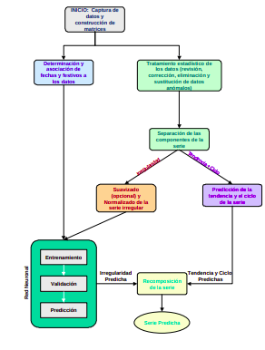
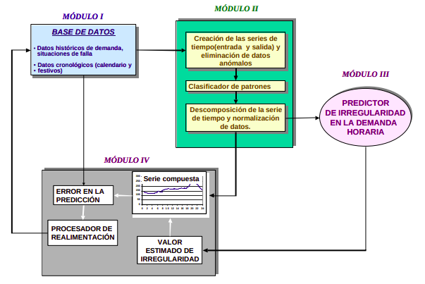
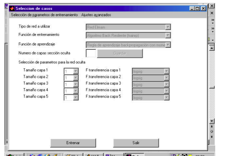

Technical support for master thesis in electrical engineering (UIS) with title "PREDICCIÓN DE DEMANDA DE CORTO PLAZO EMPLEANDO REDES NEURONALES"

***********************************

development of a suite for design of neural networks for forecasting energy markets 

client from colombia \
matlab\
lib temporal time series analysis, AI, ANN, sliding window\
development time 16 months

|   |  |
|---|--|
|solution logic || 
|tool modules ||
|gui || 
|ANN configuration ||
|prediction output|| 
